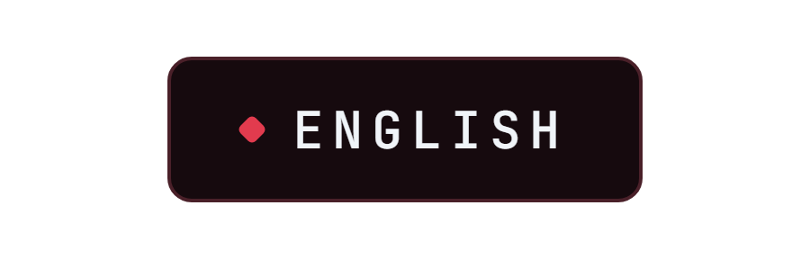
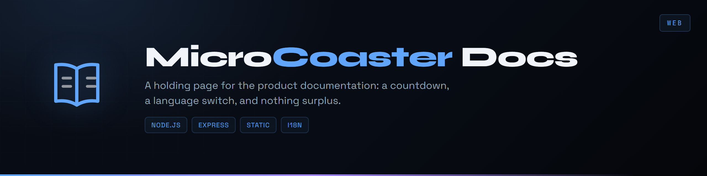
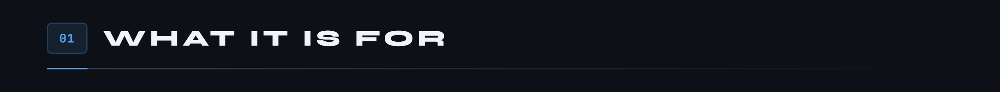
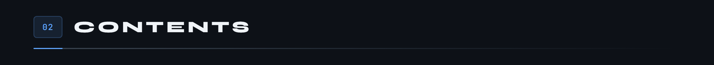
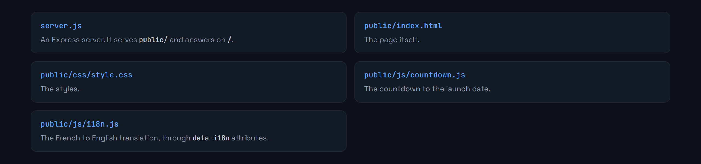
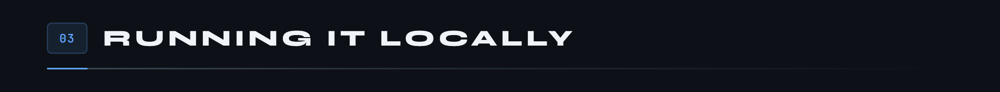
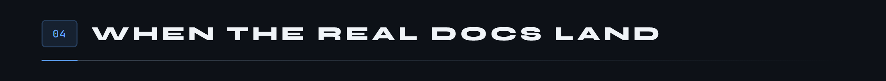

<div align="center">

<p>
  <a href="README.md"></a>
  
</p>



</div>

**The holding page for the MicroCoaster product documentation: a countdown, a language switch, and nothing surplus.**



The official documentation is not published yet. This page occupies the domain in the meantime: a countdown to going live, a message explaining what is coming, and a display in French or English depending on the visitor.

An Express server serving static files, nothing more. No site generator, no build step. That choice is not laziness: a holding page that needs a toolchain is a holding page nobody dares touch again.







```bash
npm install
npm start
```

The server listens on `http://localhost:3000`, or on `PORT` if the variable is set.



The idea is to replace `public/` with the output of the documentation generator, keeping `server.js` exactly as it is. The holding page then becomes the 404 page, or disappears.

Written in Node.js 18 and Express 4.18. MIT licence.

---

<sub>MicroCoaster · Author: Cybertrist</sub>
