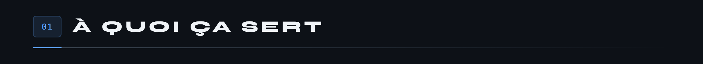
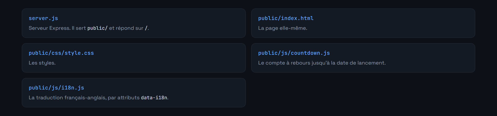

<div align="center">

<p>
  
  <a href="README.en.md"></a>
</p>


</div>

**Page d'attente de la documentation produit MicroCoaster : compte à rebours, bascule de langue, et rien de superflu.**



La documentation officielle n'est pas encore publiée. Cette page occupe le domaine en attendant : compte à rebours vers la mise en ligne, message d'explication, et affichage en français ou en anglais selon le visiteur.

Un serveur Express qui sert du statique, rien de plus. Pas de générateur de site, pas d'étape de build. Ce choix n'est pas de la paresse : une page d'attente qui demande une chaîne de compilation est une page d'attente qu'on n'ose plus toucher.





```bash
npm install
npm start
```

Le serveur écoute sur `http://localhost:3000`, ou sur `PORT` si la variable est définie.


L'idée est de remplacer `public/` par la sortie du générateur de documentation, en gardant `server.js` tel quel. La page d'attente devient alors la page 404, ou disparaît.

Écrit en Node.js 18 et Express 4.18. Licence MIT.

---

<sub>MicroCoaster · Auteur : Cybertrist</sub>
